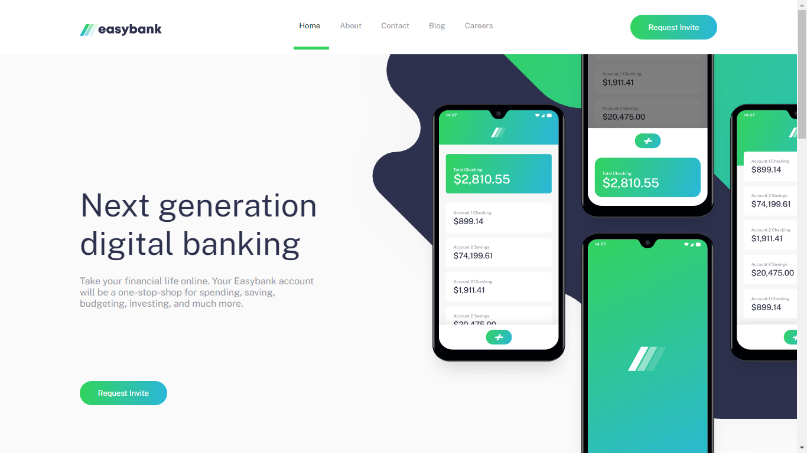

# Welcome! 👋

# Frontend Mentor - Easybank landing page solution

This is a solution to the [Easybank landing page challenge on Frontend Mentor](https://www.frontendmentor.io/challenges/easybank-landing-page-WaUhkoDN). Frontend Mentor challenges help you improve your coding skills by building realistic projects. 

## Table of contents

- [Overview](#overview)
  - [The challenge](#the-challenge)
  - [Screenshot](#screenshot)
  - [Links](#links)
- [My process](#my-process)
  - [Built with](#built-with)
  - [What I learned](#what-i-learned)
  - [Continued development](#continued-development)
- [Author](#author)

## Overview

### The challenge

Users should be able to:

- View the optimal layout for the site depending on their device's screen size
- See hover states for all interactive elements on the page

### Screenshot



### Links

- Live Site URL: [easybank_landing_page](https://liwgar.github.io/easybank_landing_page/)

## My process

### Built with

- Git & Github.
- Semantic HTML5 markup.
- CSS custom properties.
- Flexbox.
- CSS Grid.
- JavaScript.
- [Styled Components](https://styled-components.com/) - For styles
- Desktop-first workflow.

### What I learned

- Apply responsive design for any device.
- Apply flexbox and grid.
- Improve semantic HTML5 markup.
- Improve CSS custom properties.

```html
<h1>Some HTML code I'm proud of</h1>
```
```css
.proud-of-this-css {
  color: papayawhip;
}
```
```js
const proudOfThisFunc = () => {
  console.log('🎉')
}
```

### Continued development

The objective is:
- Improve the practice of styles with flexbox and grid.
- Increase knowledge in React.JS and backend.

## Author

- Website - [LiwGAr](https://liwgar-portfolio.vercel.app/)
- Frontend Mentor - [@Liwgar](https://www.frontendmentor.io/profile/LiwGar)


I've just completed a front-end coding challenge from @frontendmentor! 🎉

You can see my solution here: https://www.frontendmentor.io/solutions/responsive-landing-page-using-html5-css-and-javascript-ZXSh6BJfqa

Any suggestions on how I can improve are welcome!